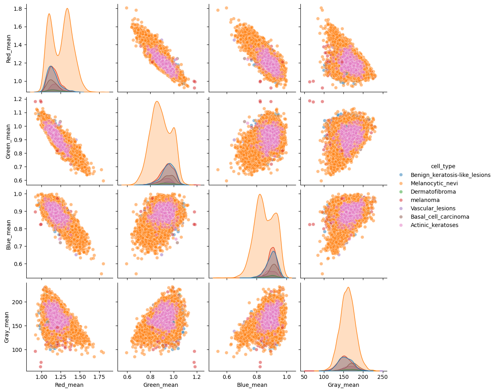

# Skin Disease Classification and Analysis

This repository contains a series of Jupyter notebooks for deep learning-based classification and exploratory analysis of skin disease images using various convolutional neural network (CNN) architectures. The project aims to benchmark multiple models, analyze performance metrics, and build an ensemble for improved diagnostic accuracy.

## 📁 Notebooks Overview

| Notebook Name             | Description |
|---------------------------|-------------|
| `Baseline.ipynb`          | Implements a basic CNN model to serve as a benchmark for comparison with more advanced architectures. |
| `Densenet201.ipynb`       | Applies the DenseNet-201 architecture with transfer learning to classify skin diseases. |
| `Ensemble.ipynb`          | Combines predictions from multiple models (Inception, DenseNet, etc.) using ensemble methods to improve overall accuracy. |
| `Exploration.ipynb`       | Performs exploratory data analysis (EDA) on the skin disease dataset, including visualizations and insights into class distribution. |
| `InceptionV2.ipynb`       | Implements and evaluates the InceptionV2 model using transfer learning for image classification. |
| `InceptionV3.ipynb`       | Fine-tunes the InceptionV3 model on the dataset and evaluates its performance. |
| `VGG16.ipynb`             | Uses the VGG16 architecture to train a classifier and analyze results with different tuning strategies. |
| `images.ipynb`            | Generates and visualizes sample images from different disease categories for inspection and reporting. |
| `metrics_analysis.ipynb`  | Aggregates and compares model performance metrics (accuracy, precision, recall, F1-score, confusion matrix, etc.) across all models. |

## 🛠️ Tools & Frameworks

- Python 3
- TensorFlow / Keras
- Matplotlib, Seaborn (for visualization)
- Scikit-learn (for evaluation metrics)
- Jupyter Notebook

## 🧠 Project Goals

- Benchmark different CNN architectures on skin disease image classification.
- Analyze model strengths, weaknesses, and confusion matrices.
- Build an ensemble system to enhance diagnostic performance.
- Provide reproducible code and results for medical AI research.

---

## Model Performances
### Individual Models
| Model         | Training Acc | Validation Acc | Testing Acc |
|---------------|--------------|----------------|-------------|
| Baseline      | 71.88%       | 72.60%         | 74.05%      |
| VGG16         | 79.69%       | 77.05%         | 77.54%      |
| InceptionV3   | 75.41%       | 76.16%         | 77.84%      |
| InceptionV2   | 81.62%       | 82.26%         | 81.94%      |
| DenseNet201   | 85.63%       | 83.48%         | 82.53%      |

### Ensemble Models

| Ensemble Models                     | Validation Acc | Testing Acc |
|-------------------------------------|----------------|-------------|
| InceptionV3 + InceptionV2 + DenseNet| 84.47%         | 83.43%      |
| InceptionV2 + DenseNet              | 85.59%         | 83.93%      |

**Note**: The dataset, models, and intermediate files are excluded from the repository and are listed in `.gitignore` for performance reasons.

